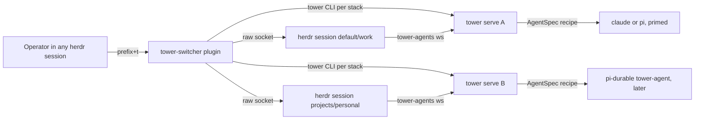

# Multi-domain operation: stacks, a herdr plugin, a primed agent kind, and Pi Durable

Date: 2026-10-05. Research note for a concept exploration; **no decision is
taken here**. It records what is verifiably true on this machine today, what
each proposed concept would require, and the open questions that gate a
decision. Extends the "stack" idea from
[operator skills](operator-skills.md) (a stack is a naming convention) to
the real multi-domain layout.

## 1. The current layout, verified

Two herdr **named sessions** are running (verified via
`herdr session list` and raw socket queries):

| Session | Socket | Character | Workspaces (label → panes) |
|---|---|---|---|
| `default` | `~/.config/herdr/herdr.sock` | work | clio_rpc, grow (9), vlex-monorepo, gems, knowledgebase, herdr, billing-service, themis, **tower-agents (wG)**, ruby_service_bucket, … |
| `projects` | `~/.config/herdr/sessions/projects/herdr.sock` | personal | okf, com.geoffjay, ocre, agentd, lore, com.geoffjay.track, templ-ui, tower, **tower-agents (wS)** |

Key verified mechanics:

1. **A named session is a full second herdr server**: own socket, own panes/
   tabs/workspaces, own workspace-id space (both sessions have a `w1`), own
   `tower-agents` workspace. Shared: global `config.toml`, plugin registry
   (plugins are user-global, available in every session), binary.
2. **CLI session targeting works via three mechanisms on 0.8.2** (all
   verified with a scrubbed environment): `--session <name>`,
   `HERDR_SESSION=<name>`, and `HERDR_SOCKET_PATH=<path>` each retarget
   `herdr` CLI commands to that session's server; with none set, commands
   hit the default session. Every herdr pane process inherits
   `HERDR_SESSION` + `HERDR_SOCKET_PATH` from its pane, so commands run
   inside a pane target that pane's session **by env, not by choice**.
   This is also how the running `tower serve` (PID 48730, started Sep 29
   in a shell whose env pointed at the default session) came to drive the
   **default** session: verified by which session hosts the
   `phones-integration-*` agents it spawned — `agent.list` on the default
   socket returns them. Nothing in tower's config records or pins the
   choice; the binding is whatever env the launching shell happened to
   carry.
3. **tower's herdr binding is inherited env, not configuration.**
   `serve.rs:45` builds `HerdrDriver::new()` with empty `herdr_args`; the
   `[herdr] socket_path` config key is dead config (never read by the
   driver). The driver inherits whatever `HERDR_*` env the launching
   shell had — or defaults to the default session. `tower-agents`
   workspace creation is by *label* (`herdr.rs:166`), so both sessions
   can carry their own `tower-agents` workspace, but only the session
   the driver talks to is driven.
4. **tower state is one home** (`~/Library/Application Support/tower/`,
   `TOWER_HOME` override, no per-domain split today). One `tower serve`, one
   `tower.db`, one token. The agents of the other session are invisible to
   it (its inventory only reconciles the driven session).

So "two stacks" today = two herdr sessions + one tower server accidentally
scoped to one of them. Any multi-domain concept must first make session
targeting explicit.

## 2. What "a stack" could mean (concept space)

The operator-skills decision already defines a stack as a naming
convention (`<stack>-<role>` agents, `stack:<stack>` tags). The domain
layout suggests three possible layers, not mutually exclusive:

| Layer | Unit | Isolation | Tower's current view |
|---|---|---|---|
| **Domain** (work/personal) | herdr session (today) | separate panes, separate `tower-agents` | invisible beyond the driven session |
| **Stack** (a purpose: "phones-integration", "tower") | naming convention + workspace or tab group | none (same session, same DB) | full (agents, tasks, schedules by name/tag) |
| **Workspace** (one repo/task) | herdr workspace | separate tabs | `workdir` on the agent row |

Nothing *requires* one domain = one session; a second work stack could live
in the same session as another tab group. The session split buys terminal
focus isolation (attach to "work" vs "personal" client), not coordination
isolation.

## 3. Concept A — a herdr plugin as the cross-stack control point

### 3.1 What herdr plugins are (verified, 0.8.2 local + 0.9.3 docs)

A plugin is a directory with `herdr-plugin.toml` + argv commands; no SDK —
the full herdr CLI *is* the plugin API. herdr owns manifest validation,
keybindings (`[[keys.command]] type = "plugin_action"`), panes (popup/
overlay/split/tab/zoomed placements), event hooks (`[[events]] on =
"worktree.created"`), startup hooks, and link handlers. Runtime env:
`HERDR_BIN_PATH`, `HERDR_SOCKET_PATH`, `HERDR_PLUGIN_ID/ROOT/CONFIG_DIR/
STATE_DIR`, `HERDR_PLUGIN_CONTEXT_JSON` (workspace/tab/pane/agent ids of the
invocation context). Install: `herdr plugin link <path>` (local) or
`herdr plugin install owner/repo` (GitHub). Plugins are **user-global**:
registered once, available in every herdr session. Local 0.8.2 already
supports `plugin list/link/uninstall`, `plugin action list/invoke`,
`plugin pane open` (herdr-bar is installed and works).

### 3.2 Why a plugin fits "call up from any herdr session"

The plugin's commands run with the *invoking session's* env — but a plugin
is just argv, so it can target any stack explicitly:

- An **action** (bound to a key, e.g. `prefix+t`) opens a popup pane
  listing every stack: enumerate herdr sessions (`herdr session list
  --json`), then query each by running `HERDR_SESSION=<name> herdr agent
  list --json` / `workspace list --json` (or speaking the raw JSON
  socket protocol directly — verified with a Python one-liner against
  both sockets) and show per-stack status (agents, states, workdirs).
- Selecting an agent could `HERDR_SESSION=<name> herdr workspace focus` /
  `agent focus` in the TUI client (attach-level focus) — or, for the
  tower side, `tower --url/--token` of that stack's server.
- An **event hook** (`on = "agent.state_change"`) could relay herdr-native
  state transitions into tower's inbox or a notification.

This is the only concept that needs **zero tower changes** to start: the
plugin shells out to `herdr` (session-scoped via `HERDR_SESSION`) and
`tower` (stack-scoped via `TOWER_HOME`/`TOWER_URL`).

### 3.3 What it would look like

```text
tower-multistack/            # or "tower-switcher"
  herdr-plugin.toml          # id = "dev.tower.switcher"
  tower-switch               # bash or node; reads HERDR_PLUGIN_CONTEXT_JSON
```

- `[[actions]] id = "switch"` → popup pane: sessions → stacks → agents,
  fuzzy-picked, driving `herdr`/`tower` CLIs against the chosen socket/env.
- `[[panes]] id = "board"` → a `tower ps`-style live board for the chosen
  stack (poll `tower ps --json`, render), placement `popup`.
- `[[events]] on = "agent.state_change"` → (later) push blocked/working
  transitions to a tower inbox or desktop notification.

### 3.4 Gaps / risks

- herdr 0.9.3 (current stable) is the documented plugin surface; local
  0.8.2 has a subset. The doc's `min_herdr_version` field exists for
  exactly this; the plugin should pin to what 0.8.2 verifies.
- The plugin cannot extend tower's own TUI; it lives in herdr's UI.
- Event-hook coverage on 0.8.2 (which `on = …` names exist) is unverified.

## 4. Concept B — a tower-primed custom agent kind

Goal: an agent that already knows the work loop, the docs, the skills, and
its identity, instead of receiving the brief via first prompt.

Options verified on this machine:

| Option | Mechanism | Effort | Notes |
|---|---|---|---|
| **herdr custom kind** | `herdr agent start <name> --kind <kind>` supports 25 kinds (0.9.3: adds `letta`, `muse`); no local "add custom kind" CLI found, but detection manifests (`~/.local/state/herdr/agent-detection/remote/*.toml`) are TOML, and the "Add Herdr support" path exists for self-built agents (`pane report-agent --state … --resume-cmd`) | high | A *custom kind* means tower owns a wrapper executable; herdr's detection then needs a manifest for it. Not needed for the priming goal alone. |
| **Kind + primed launch args** | Keep `kind = "claude" | "pi"`; tower's `AgentSpec.args/env` (D§8) already passes harness args (`--append-system-prompt`, `--session-dir`, `-e <ext>`) and env (`TOWER_AGENT`) | low | This is 90% of the concept: a "tower-primed" launch recipe per harness. pi already supports `--append-system-prompt <file>` and `--extension`; claude supports `--append-system-prompt` and `CLAUDE.md`/skills dirs. |
| **pi extension** | `~/.pi/agent/extensions/*.ts` (or `pi install <src>`): registers prompt sections, tools; loaded by name per session | medium | Could embed the work-loop contract as a prompt section + a `tower` tool wrapper. Extensions are global unless selected per launch (`-e`). |
| **pi-durable program** (Concept C) | A custom harness binary that *is* the agent | high | Subsumes B; see §5 |

A "tower agent definition" therefore has a natural ladder:

1. **Now (no code)**: a documented launch recipe — spawn `pi` with
   `--append-system-prompt docs/agent-loop.md` (or a condensed
   work-loop file) + `TOWER_AGENT` env; spawn `claude` with the same via
   `--append-system-prompt`. The operator-skills brief already carries the
   loop; baking it into the launch removes the per-job briefing cost.
2. **Small code**: tower gains a `kind = "tower-pi"` recipe (config:
   prompt file + extension list per kind) — a config-keyed set of
   `AgentSpec` defaults, not a new binary.
3. **Full**: a custom harness (Concept C) with the loop as its runtime.

## 5. Concept C — Pi Durable as the tower agent harness

[@earendil-works/pi-durable](https://github.com/earendil-works/pi/blob/main/packages/durable/README.md)
(experimental; API changes without notice): a durable agent harness where
conversations, turns, tool calls, and custom state are committed to storage
(SQLite/JSONL) before anything is shown; crash → reopen → `resume()`
continues the unfinished run. Core primitives: `Harness.open(storage, {models,
registry, env})`, `root()`/conversations, durable `submit()` (+ `requestId`
dedup), built-in generation/tool tasks, extensions (tools/sections/hooks),
per-conversation agent config, task graphs/subagents, `watch()`/
`viewState()` for UIs, `watchEvents()` for coding-agent-style event
streams, compaction, `reset()` handoff.

### 5.1 Why it maps well to tower's agent contract

| tower need (D§8) | pi-durable primitive |
|---|---|
| Long-running agent across server loss | storage-backed conversation; `resume()` on boot — stronger than herdr pane persistence alone (the *run* survives, not just the process) |
| Work loop (declare/heartbeat/report) | a custom durable **task** (e.g. `tower.workloop`) owning the conversation: heartbeat = periodic commit; status = committed entries; completion = task outcome |
| tower MCP tools as agent tools | define an extension registering `tower_*` tools that call the tower REST API; identity via env/headers baked into the env builder |
| Operator reads agent output | `watchEvents()` → SSE-shaped stream → tower's event bus; or `viewState()` snapshots |
| `blocked` state | a `beforeTool` hook or explicit approval gate → report `blocked` to tower via REST and park |
| Detection (herdr state) | could use herdr's own integration path (`pane report-agent`) — a pi-durable agent can report state/resume-cmd itself, becoming a first-class herdr agent with exact states instead of screen-scraped ones |

### 5.2 What "build the tower agent harness on pi-durable" means concretely

A small Node/Bun program `tower-agent` (one per spawned agent):

```text
tower-agent/
  index.ts        # Harness.open(sqlite at $TOWER_AGENT_STATE), registry with TowerTools
  tower-tools.ts  # tower_* REST wrappers (submit/status/complete/inbox)
  workloop.ts     # durable task: poll inbox → run → report → heartbeat
```

- tower's `HerdrDriver` launches it like any kind (`herdr agent start
  <name> --kind ??? --pane …`). herdr has no `tower-agent` kind; the
  "add Herdr support" path (`pane report-agent --state working …` +
  `--resume-cmd`) makes it a first-class herdr agent **without a
  manifest** — verified API on 0.8.2's socket surface
  (`agent.list` etc. exist; `report-agent` needs checking locally).
- It would run in a pane but be headless-ish: TUI-less operation with
  state surfaced through tower + herdr's integration reports.

### 5.3 Risks / open questions

- **Experimental**: API changes without notice; pin versions.
- **Model access**: pi-durable is harness-only; tower would need pi-ai
  providers configured (model API keys) — same key-management problem as
  any custom harness, orthogonal to tower's server.
- **Duplication**: tower's job lease/heartbeat and pi-durable's durable
  tasks overlap. Keeping tower the *coordinator* (leases, assignment) and
  pi-durable the *execution spine* (conversation durability, tool
  dispatch) is coherent, but the boundary needs a written rule (which side
  owns "is the work running?").
- **Detection**: unless it self-reports via herdr's integration API, a
  headless pi-durable program has no detection manifest → `unknown` state
  in herdr, degrading tower's free state model.
- **Cost**: a new program to build and test vs. driving existing claude/pi
  CLIs. Only worth it if run-durability (resume mid-turn) or custom
  tool loops matter more than harness-CLI leverage.

## 6. How the concepts compose

They are layers, not competitors:



- The **plugin** (A) is the operator's cross-stack surface; needs tower's
  session binding to become explicit (§7.1) or works purely as a
  navigator with one tower server.
- The **primed kind** (B) is what tower spawns; it can start as a launch
  recipe today.
- **pi-durable** (C) is a later execution substrate for the spawned kind
  where durability of the *run* matters.
- A multi-tower (one server per domain) or single-tower (one server, both
  sessions driven — needs driver multi-session support) topology is an
  independent axis, decided by §7.1/§7.2.

## 7. Gating questions (decide before building)

1. **Session binding**: tower's driver must take an explicit herdr socket
   (honor `[herdr] socket_path` in config, or a `--herdr-session` flag on
   serve) before *any* cross-session concept works. Today the binding is
   inherited env — the running server drives the default session with no
   config recording why. Small, obvious fix; prerequisite for everything.
2. **One tower or N towers**: one server per domain (`TOWER_HOME` per
   domain, separate DBs/ports/tokens — everything already supports it via
   env) vs. one server driving both sessions (needs a driver that fans out
   to multiple sockets and an inventory that tags agents by session).
   Recommendation to evaluate: **one server per domain** first — zero
   code, clean isolation, and the plugin/CLI can address them by env
   (`TOWER_HOME=... tower ps`).
3. **Plugin scope**: navigator-only (list/focus/attach) first, or also
   drive tower verbs (ps/task list per stack)? The navigator needs no
   tower changes.
4. **Priming mechanism**: launch-recipe (args/env per kind) now, or wait
   for a config-keyed recipe in tower? The skills already exist; the
   question is whether the loop contract should live in the spawn or the
   brief.
5. **pi-durable trigger**: only if mid-turn crash resume or custom tool
   loops become real requirements. Not justified by the current
   claude/pi flow, which herdr already detects and tower already drives.

## Sources

- Local: `herdr` 0.8.2 binary (`herdr --skill`, `plugin`, `session`,
  `status server`, raw socket queries to both session sockets);
  `herdr api schema`; live `tower serve` process and `tower ps`.
- [herdr 0.9.3 docs](https://herdr.dev/llms.txt): Plugins, Agent
  automation, Add Herdr support, Persistence and remote access
  (named sessions), CLI reference (env vars, `--machine`), Marketplace.
- [pi-durable README](https://github.com/earendil-works/pi/blob/main/packages/durable/README.md)
  (fetched 2026-10-05; experimental) and
  [Pi Durable post](https://earendil.com/posts/pi-durable/).
- Repo: [operator-skills decision](operator-skills.md) (stack = naming
  convention), D§8 (harness layer, `tower-agents` placement),
  [cross-server decision](cross-server.md) (single-coordinator model).
